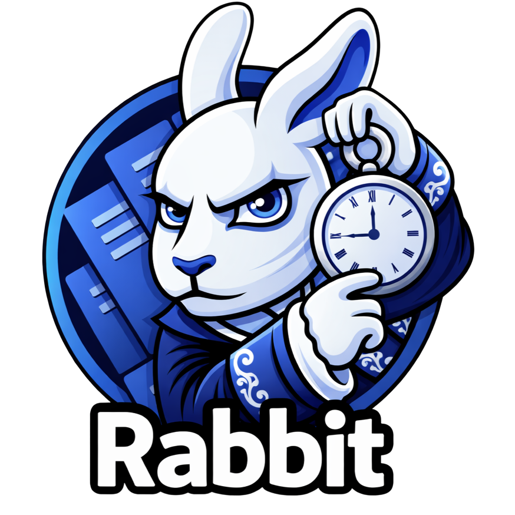
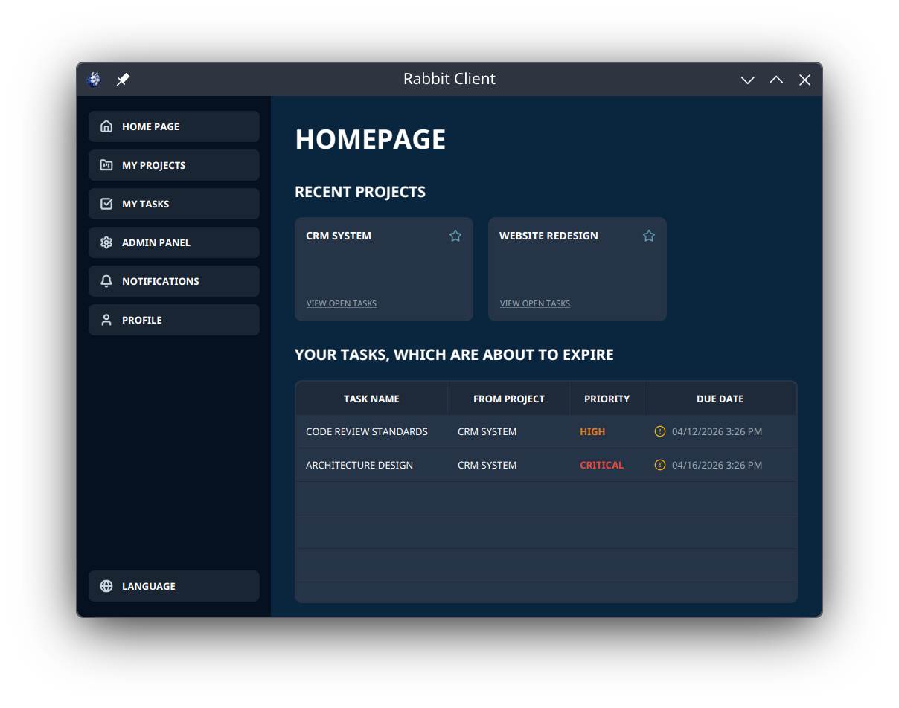
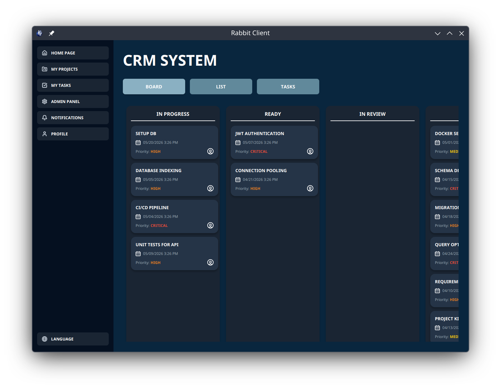
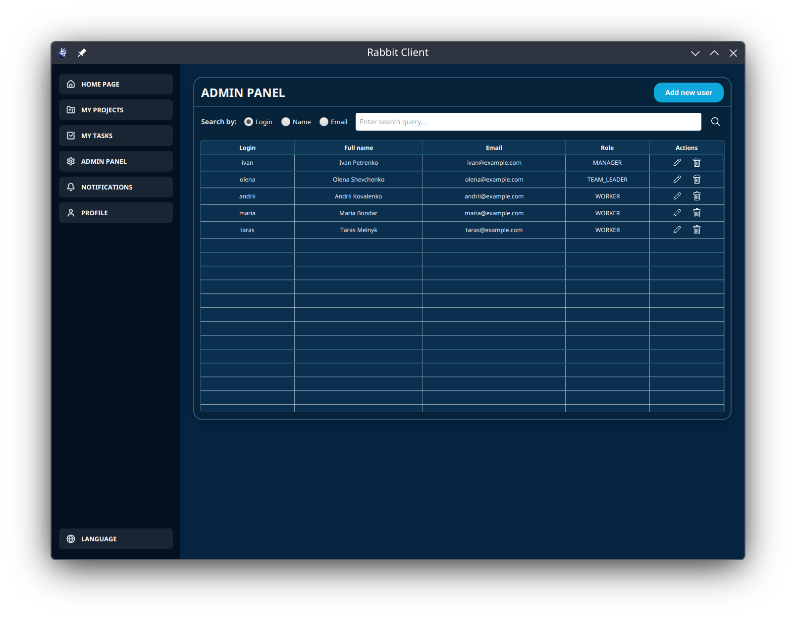
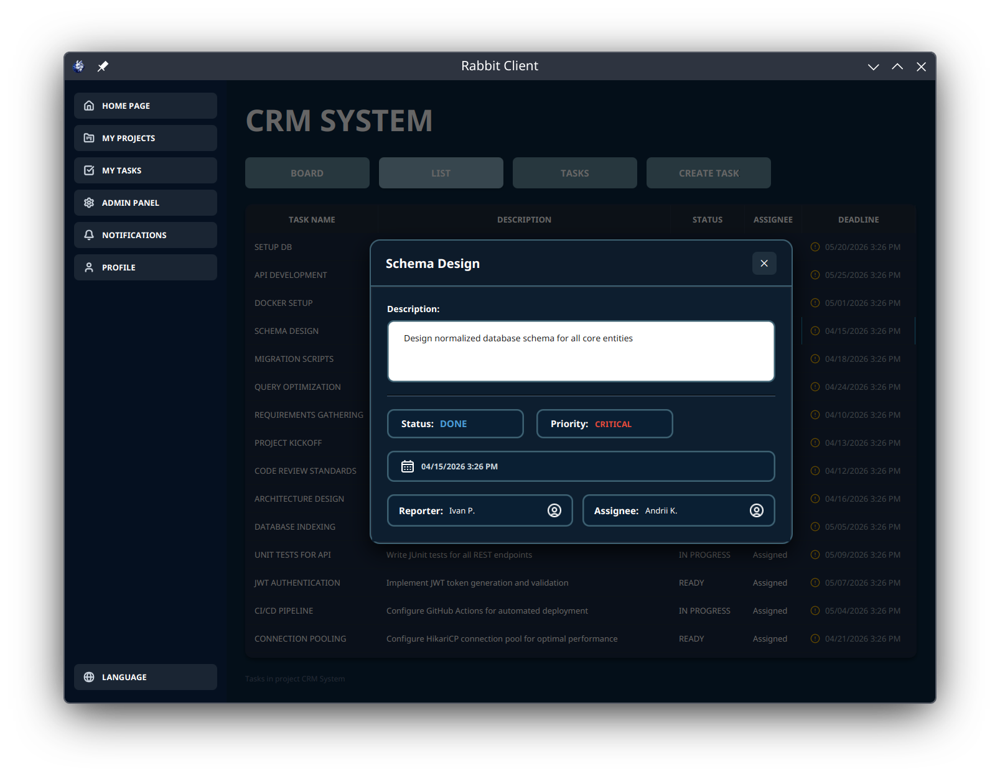
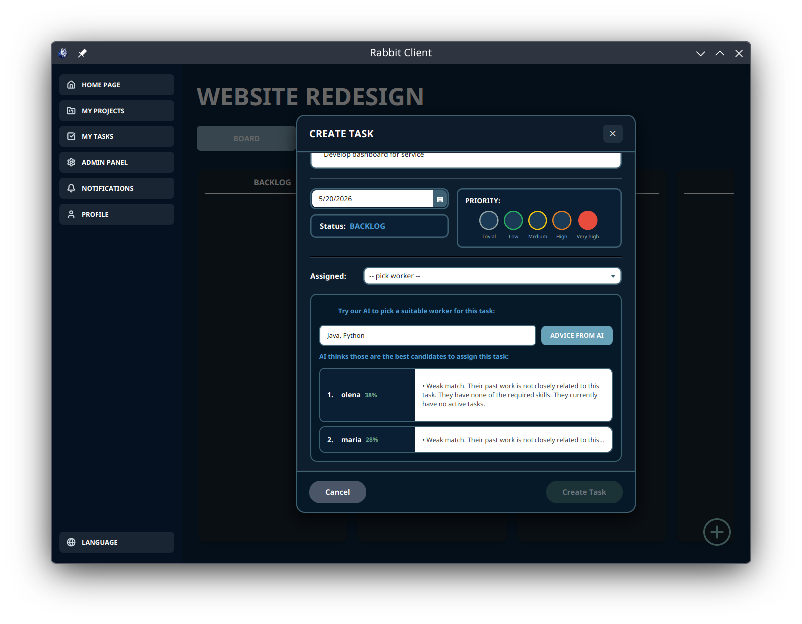

# Rabbit




## Overview
Rabbit is a student Java project composed of:

- `server` — Java backend with HTTP server and PostgreSQL integration
- `client` — JavaFX client application for the graphical interface
- `common` — shared models and DTOs for both client and server

## Screenshots

Add a few UI screenshots here:

- `screenshots/desktop-1.png`
- `screenshots/desktop-2.png`


<div align="center">
  
  
</div>

<div align="center">
  
  
</div>

## Technologies

- Java 25
- JavaFX 25
- Python
- Maven
- PostgreSQL
- Docker / Docker Compose
- JSON processing with Jackson
- Environment variables loaded via `java-dotenv`

## Repository Structure

- `client/` — JavaFX UI, FXML, resources
- `server/` — HTTP server, database, migrations
- `common/` — shared models, enums, DTOs
- `model/` — utility scripts / research section (not part of the main Maven project)

## Preparation

1. Create a `.env` file in the project root.
2. Copy all variables from `.env.example` into the file.
3. Adjust values for your local environment if needed.

> The `.env` file is required to configure database access and other environment settings.

## Running the Project

### 1. Start the database

Docker and Docker Compose are required.

```bash
docker compose up -d
```

### 2. Migrations

The project uses an SQL migration system stored in `server/src/main/resources/migrations`.
New migrations should be added in the format:

```text
V{{migration_number}}__{{description}}.sql
```

Migrations are validated automatically when the server starts.

### 3. Start the server

```bash
mvn clean compile exec:java -pl server
```

### 4. Start the client

```bash
mvn clean compile javafx:run -pl client
```

## Verify the server

After the server is running, check the basic endpoint:

```bash
curl http://localhost:6969/hello
```

## PGAdmin Setup (optional)

Open:

```text
http://127.0.0.1:8080/
```

Login:

- email: `admin@example.com`
- password: `admin`

Add a server in PGAdmin:

- Hostname: `rabbit_db`
- Port: `5432`
- Username: `user`
- Password: `password`

## Notes

- Before starting the server, make sure the PostgreSQL Docker containers are running.
- If the project cannot find JavaFX, verify that JavaFX is available to the Maven plugin.

---

The AI part of this project is based on: https://github.com/nobujinn/smart-task-assignment

The authors of this project are a team of VAVA students; the code is organized into the modular structure `client`, `server`, `common`.
